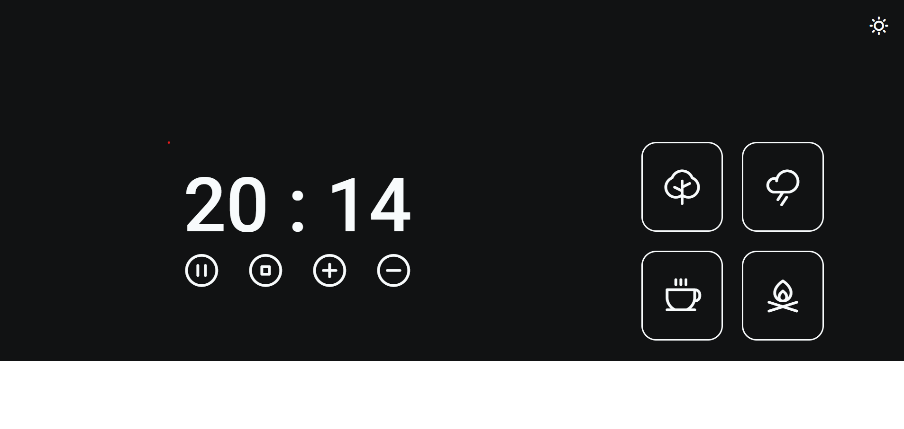
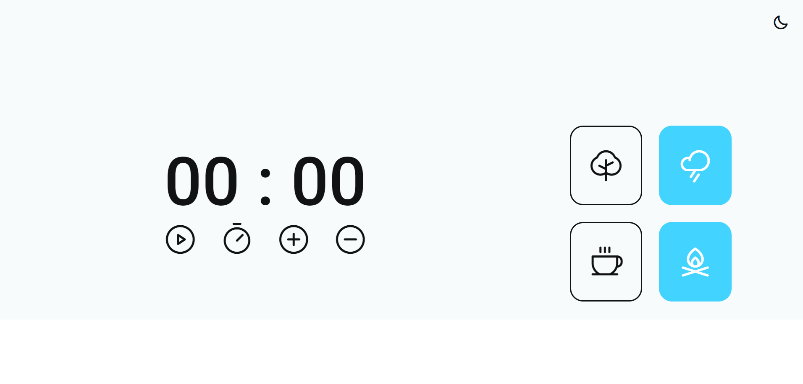

<h1 align="center"> Desafio FocusTimer </h1>

Programa exclusivo do Bruno Bianchi, para ensino de tecnologias WEB.  
Desafio proposto pela Rocketseat, com objetivo de criar o FocusTimer, utilizando os seguintes recursos:

Cada card que se encontra do lado direito, quando selecionado, vai mudar de cor e emitir um som diferente. Os sons você pode encontrar, respectivamente, nos links abaixo:

[**Floresta**](https://drive.google.com/file/d/1CRHkV72WUMdcqec5GT_KdsqFz0z3VAOA/view)

[**Chuva**](https://drive.google.com/file/d/1Ip8xBqAUJ-bty51Wz8JBtX_bWXCgA0P2/view)

[**Cafeteria**](https://drive.google.com/file/d/1OxLKpCwg2wrxXFNUHgZxJ51QEt0ac5RA/view)

[**Lareira**](https://drive.google.com/file/d/1MakaBPxJvTa_whaSM3kEbRcxiVd1GRCB/view)

Funcionalidades esperadas dos botões:

- Play: aciona o timer;
- Stop: para o timer;
- ( + ): aumenta em mais 5 minutos o tempo do timer;
- ( - ): diminui em 5 minutos o tempo do timer.
- Clicar no icone no canto superior direito: Alterna entre o tema claro e escuro 

  <a href="#-tecnologias">Tecnologias</a>&nbsp;&nbsp;&nbsp;|&nbsp;&nbsp;&nbsp;
  <a href="#-projeto">Projeto</a>

  

  
  

 

## 🚀 Tecnologias

Esse projeto foi desenvolvido com as seguintes tecnologias:

- HTML e CSS
- Javascript
- Git e Github

## 💻 Projeto

O Desafio é criar Focus Timer utilizando alguns recursos específicos.

- [Acesse o projeto finalizado, online](https://brunobianchi13.github.io/Desafio-Focus-Timer/)
- [Acesse o Layout no Figma](https://www.figma.com/file/2PHsiNACU7z213ktnZvfUg/Stage-05---Focus-Timer-2.0-(Copy)?type=design&node-id=0-1&mode=design&t=S0KryFtfzNsrxjWN-0)

---

Feito by Bruno Bianchi

